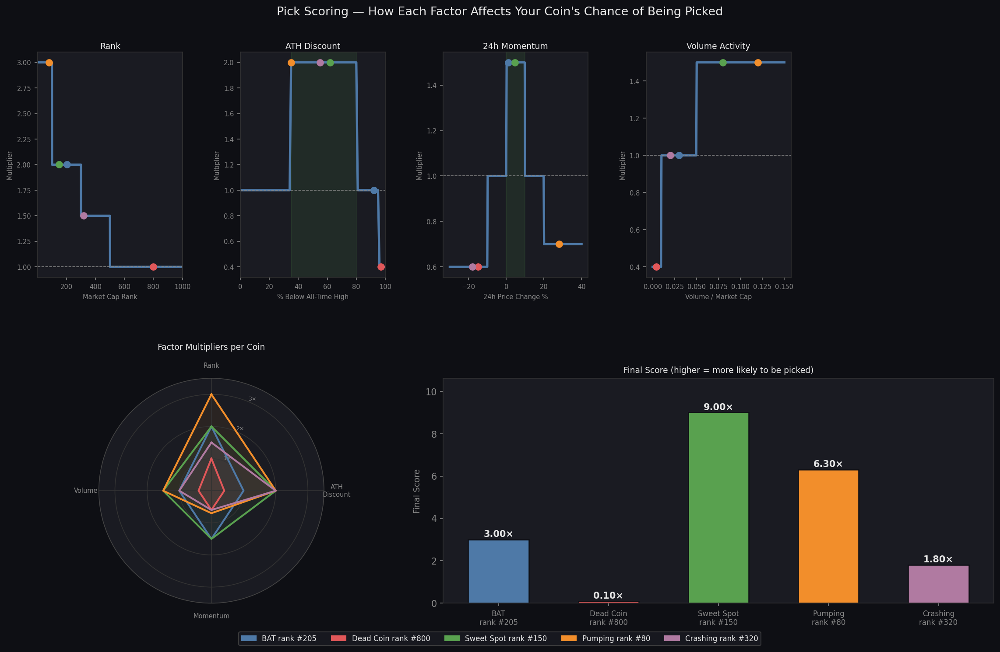

# crypto-team-bot

A Discord bot for tracking a group crypto portfolio, generating biweekly coin picks, and posting price alerts.

## Commands

| Command | Description |
|---|---|
| `/buy` | Log a group buy — symbol, USD spent, quantity, optional date |
| `/history` | Portfolio summary with live P/L per coin. Pass `include_buys:true` for individual entries |
| `/removebuy` | Delete a logged buy by row ID (get the ID from `/history`) |
| `/pick` | Run the weighted pick algorithm manually and post the result |
| `/chart` | Candlestick chart for any coin. Options: `days` (1/7/14/30/90/180/365/max), `ma` (e.g. `7,20`) |
| `/alertx` | Set the X-multiple alert threshold globally or per symbol (e.g. `multiple:5`) |
| `/removealert` | Remove a per-symbol alert override, falls back to global default |
| `/alerts` | List all alert rules and the last step fired for each |
| `/alertstatus` | Show per-coin alert math — cost, price, multiple, next target |
| `/checkalerts` | Trigger an alert check immediately instead of waiting for the 10-minute loop |
| `/ping` | Health check |

## Biweekly Pick

Every other Friday at 10:00 UTC the bot automatically posts a pick to the announce channel.

The pick uses a **weighted random** draw — not pure random. Each candidate is scored on:

- **Rank** — top 100 = 3×, top 300 = 2×, top 500 = 1.5×
- **ATH Discount** — 35–80% below ATH = 2× boost; 95%+ below (likely dead project) = 0.4× penalty
- **24h Momentum** — gentle uptrend (0–10%) = 1.5×; already pumping (>20%) or dumping (<-10%) = penalized
- **Volume/MCap ratio** — active trading (>5%) = 1.5×; ghost coin (<1%) = 0.4× penalty

Filters applied before scoring: no stablecoins, no BTC/ETH/DOGE, must be Coinbase-listed, must be ≥30% below ATH, no repeats within 8 weeks.

### Scoring Visualised



The **top row** shows how each factor's multiplier changes across its range — the green shaded zones are the sweet spots. Each coloured dot is one of the five example coins plotted against that factor.

The **bottom left** radar shows all four multipliers at once per coin — a coin that fills out all four axes is getting boosted on every factor.

The **bottom right** is the final combined score. The Sweet Spot coin (rank #150, 62% below ATH, slight uptrend, active volume) scores 9× while the Dead Coin (rank #800, 97% below ATH, dumping, no volume) scores 0.10×. Higher score = higher probability of being selected, but it's still random so lower-scored coins can still win.

## Alerts

The bot checks every 10 minutes. An alert fires when a coin's price crosses a new multiple of your average cost (default 5×). Each crossing step only fires once.

## Discord Setup

1. Go to [discord.com/developers/applications](https://discord.com/developers/applications) and click **New Application**
2. Give it a name, then go to the **Bot** tab and click **Add Bot**
3. Under **Privileged Gateway Intents**, enable **Message Content Intent**
4. Copy the token — paste it into your `.env` as `DISCORD_TOKEN`
5. Go to **OAuth2 → URL Generator**, select scopes: `bot` and `applications.commands`
6. Under Bot Permissions select: `Send Messages`, `Embed Links`, `Attach Files`, `Read Message History`
7. Copy the generated URL, open it in a browser, and invite the bot to your server
8. In your server, right-click the server icon → **Copy Server ID** and set it as `GUILD_ID` in your `.env` (requires Developer Mode — enable it under Discord Settings → Advanced)
9. Right-click your announcements channel → **Copy Channel ID** and set it as `ANNOUNCE_CHANNEL_ID`

## Local Setup

```bash
cp .env.example .env
# fill in .env

python3 -m venv .venv
source .venv/bin/activate   # Windows: .venv\Scripts\activate
pip install -r requirements.txt

python bot.py
```

### .env variables

```
DISCORD_TOKEN=
GUILD_ID=
ANNOUNCE_CHANNEL_ID=
ANNOUNCE_THREAD_ID=      # optional — post into a thread instead of the channel directly
TEST_ALERT_2PCT=false    # set true to enable +2% test nudge alerts
```

## Deployment (systemd)

For running the bot persistently on a Linux VM.

**1. Create a dedicated user and clone the repo:**
```bash
sudo useradd -r -s /bin/false cryptobot
sudo mkdir -p /opt/crypto-team-bot
sudo chown cryptobot:cryptobot /opt/crypto-team-bot
sudo -u cryptobot git clone https://github.com/milkyway1up/crypto-team-bot.git /opt/crypto-team-bot
```

**2. Install dependencies:**
```bash
cd /opt/crypto-team-bot
sudo -u cryptobot python3 -m venv .venv
sudo -u cryptobot .venv/bin/pip install -r requirements.txt
```

**3. Create your `.env`:**
```bash
sudo -u cryptobot cp .env.example .env
sudo nano /opt/crypto-team-bot/.env   # fill in your values
sudo chmod 600 /opt/crypto-team-bot/.env
```

**4. Create the systemd service** at `/etc/systemd/system/crypto-bot.service`:
```ini
[Unit]
Description=Crypto Team Bot
Wants=network-online.target
After=network-online.target

[Service]
Type=simple
User=cryptobot
Group=cryptobot
WorkingDirectory=/opt/crypto-team-bot

Environment=PYTHONUNBUFFERED=1
Environment=MPLBACKEND=Agg
Environment=MPLCONFIGDIR=/opt/crypto-team-bot/.cache/matplotlib
EnvironmentFile=/opt/crypto-team-bot/.env

ExecStart=/opt/crypto-team-bot/.venv/bin/python /opt/crypto-team-bot/bot.py

Restart=always
RestartSec=5

NoNewPrivileges=true
ProtectSystem=full
ProtectHome=true
PrivateTmp=true
LockPersonality=true

[Install]
WantedBy=multi-user.target
```

**5. Enable and start:**
```bash
sudo systemctl daemon-reload
sudo systemctl enable crypto-bot.service
sudo systemctl start crypto-bot.service
sudo systemctl status crypto-bot.service
```

**Deploying updates:**
```bash
cd /opt/crypto-team-bot
git pull
sudo systemctl restart crypto-bot.service
```
